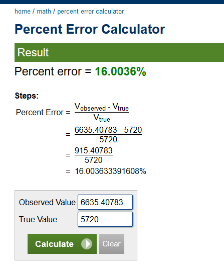

# Rainfall-Predicition_ML
after feeding 11 years of rainfall data of a specific place. This python based program can predict future rainfall the predicted value will be saved as a csv file and the model will also be saved in both standard and h5 formats. These saved models can be used for later predictions 
https://raw.githubusercontent.com/PasinduAnthony/images/master/readmeImgs/Rainfall.jpg

